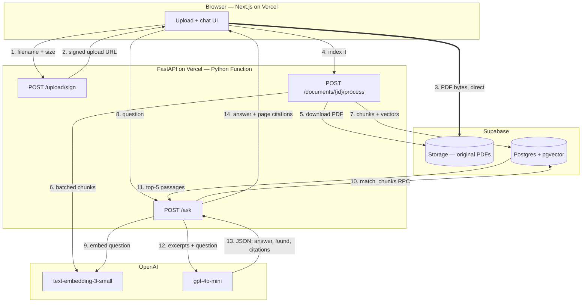

# NicheDocs AI — Grounded Document Q&A

**Upload a PDF, ask questions about it, and get answers grounded in that document — with the page and section each answer came from. When the document does not cover something, it says so instead of guessing.**

> 🔗 **Live demo:** _add your deployed URL here_
> 🎥 **Demo video (90s):** _add your Loom link here_

---

## The problem

Take a university student handbook: 80–200 pages of policy that nobody reads. Students ask the registrar the same twenty questions every semester — *what's the attendance minimum, how do I appeal a grade, when's the withdrawal deadline* — and the answers are all in a PDF they already have. The same shape recurs everywhere: employment contracts, compliance manuals, insurance policies, tenancy agreements.

The obvious fix is to hand the PDF to a chatbot. The obvious fix is also where it goes wrong: a general-purpose model will confidently tell a student the attendance requirement is 75%, because that is what it is at most universities — not because it is what *this* handbook says. In a policy domain, a plausible wrong answer is worse than no answer. The student acts on it, misses a deadline, and the institution is the one holding the problem.

NicheDocs is built around the opposite default: **answer only from the retrieved text, cite the page, or admit you don't know.**

That inversion is the whole engineering exercise. Making a RAG app answer the questions a document covers is straightforward; making it behave honestly on the questions it *doesn't* is the hard part, and it is what the architecture below is organised around.

## What it does

- **Upload** any text-based PDF (up to 20 MB) and watch it get parsed, chunked, and indexed.
- **Ask** natural-language questions in a chat UI.
- **Read** an answer built only from passages retrieved out of that document.
- **Verify** every answer against page-numbered, section-labelled citations, with the exact excerpt the model used.
- **Trust the "no"** — when retrieval finds nothing relevant, or the model judges the excerpts insufficient, you get an explicit *"Not found in this document"* card, styled differently from a real answer.
- **Switch** between multiple uploaded documents; each keeps its own chat history for the session.
- **Read it in the dark** — light, dark, and system themes.

### What it handles well, and what it doesn't

Being specific about the limits, since "chat with any PDF" is usually oversold:

| Document | Result |
|---|---|
| Flowing prose — handbooks, policies, contracts, FAQs, reports | Works well |
| Multi-column layouts (most academic papers) | Poor — `pypdf` interleaves the columns |
| Tables, figures, equations | Poor — structure is flattened into run-on text |
| Scanned / image-only PDFs | Rejected outright with a clear message (no OCR) |

Handling columns and tables properly means a layout-aware parser; that trade-off is documented in the [case study](docs/CASE_STUDY.md).

## Architecture



**Why the PDF bypasses the API (steps 2–3).** Vercel Functions reject request bodies over **4.5 MB** at the platform edge, before any of our code runs. A 20 MB document can therefore never be POSTed to the backend. Instead the backend mints a short-lived Supabase Storage signed URL, the browser PUTs the bytes straight to Storage, and only the storage path comes back to us. The backend then pulls the file *outbound*, where no such limit applies.

### Retrieval pipeline in detail

| Stage | What happens | Where |
|---|---|---|
| Extract | `pypdf` pulls text per page; hyphenated line-breaks rejoined, whitespace normalised. Scanned/image-only PDFs are rejected with a clear message rather than indexed as nothing. | [`backend/nichedocs/pdf.py`](backend/nichedocs/pdf.py) |
| Chunk | Every word is tagged with its page number and enclosing heading, then a ~600-token window slides over the tagged stream with ~90 tokens of overlap. A chunk is cited to the page where it **starts**. | [`backend/nichedocs/chunking.py`](backend/nichedocs/chunking.py) |
| Embed | Chunks are embedded in batches of 96 — one 600-chunk document costs ~7 HTTP round trips instead of 600. | [`backend/nichedocs/embeddings.py`](backend/nichedocs/embeddings.py) |
| Store | `chunks` rows carry `page_number`, `section`, `content`, and a `vector(1536)`, indexed with HNSW / cosine. | [`supabase/migrations/0001_init.sql`](supabase/migrations/0001_init.sql) |
| Retrieve | The question is embedded and matched against **only the selected document** via the `match_chunks` RPC, with a cosine floor of 0.20. | [`backend/nichedocs/store.py`](backend/nichedocs/store.py) |
| Ground | Passages are numbered `[1]…[5]` with page/section labels. The model replies in JSON with `found`, `answer`, and `citations`. Citation indices outside the supplied range are discarded as hallucinations. | [`backend/nichedocs/answering.py`](backend/nichedocs/answering.py) |

### How "I don't know" is enforced

Three independent gates, so no single failure produces a confident fabrication:

1. **Retrieval floor.** If no chunk clears 0.20 cosine similarity, the API returns *not found* without ever calling the LLM — faster, cheaper, and structurally incapable of hallucinating.
2. **Prompt contract.** The system prompt gives the model no fallback: it is told to treat itself as having no prior knowledge of the document's subject or field, that what is typical elsewhere is irrelevant, and that answering "not in this document" is a correct and valuable outcome.
3. **Citation validation.** The model returns which excerpt numbers it used. Any index outside the range we actually supplied is dropped, so a citation can never point at a passage that does not exist.

## Tech stack

| Layer | Choice |
|---|---|
| Frontend | Next.js 16 (App Router, React 19) + Tailwind CSS v4 + TypeScript |
| Backend | FastAPI (Python 3.12) |
| Database & vectors | Supabase Postgres + `pgvector`, HNSW cosine index |
| File storage | Supabase Storage (private bucket, signed upload URLs) |
| Embeddings | OpenAI `text-embedding-3-small` (1536-d) |
| Generation | OpenAI `gpt-4o-mini`, `temperature=0`, JSON mode |
| PDF parsing | `pypdf` |
| Hosting | Vercel — two projects, one repo |

## Project structure

```
.
├── backend/
│   ├── main.py                    # Vercel entrypoint; exports `app`
│   ├── nichedocs/
│   │   ├── config.py              # env -> typed Settings
│   │   ├── clients.py             # cached Supabase + OpenAI clients
│   │   ├── pdf.py                 # per-page text extraction
│   │   ├── chunking.py            # page-attributed sliding-window chunker
│   │   ├── embeddings.py          # batched embedding calls
│   │   ├── store.py               # all Supabase access (tables, RPC, storage)
│   │   ├── ingest.py              # PDF -> chunks -> vectors pipeline
│   │   ├── answering.py           # prompt + grounded JSON answer parsing
│   │   ├── qa.py                  # retrieve -> ground -> cite
│   │   ├── routes.py              # HTTP layer
│   │   ├── schemas.py             # pydantic request/response models
│   │   └── errors.py              # domain errors -> status codes
│   └── tests/                     # chunking + grounding unit tests
├── frontend/
│   └── src/
│       ├── app/                   # layout, page, globals.css
│       ├── components/            # UploadPanel, DocumentList, ChatPanel, …
│       └── lib/                   # typed API client
├── supabase/migrations/0001_init.sql
└── docs/CASE_STUDY.md
```

---

## Setup

**Prerequisites:** Node.js 20+, Python 3.12+, a Supabase project, an OpenAI API key.

### 1. Database

Open your Supabase project → **SQL Editor** → **New query**, paste the contents of [`supabase/migrations/0001_init.sql`](supabase/migrations/0001_init.sql), and run it. This creates the `documents` and `chunks` tables, the `match_chunks` RPC, the HNSW index, and the private `documents` storage bucket.

### 2. Backend

```bash
cd backend
python -m venv .venv
source .venv/bin/activate          # Windows: .venv\Scripts\Activate.ps1
pip install -r requirements-dev.txt

cp .env.example .env               # then fill in your keys
uvicorn main:app --reload --port 8000
```

Interactive API docs: <http://127.0.0.1:8000/docs>

Required environment variables are documented in [`backend/.env.example`](backend/.env.example). The two that must be set:

- `SUPABASE_URL` and `SUPABASE_SERVICE_ROLE_KEY` — Supabase → Project Settings → Data API / API Keys. **The service role key bypasses Row Level Security; keep it server-side only.**
- `OPENAI_API_KEY`

Run the tests:

```bash
pytest
```

### 3. Frontend

```bash
cd frontend
npm install
cp .env.example .env.local         # NEXT_PUBLIC_API_URL=http://127.0.0.1:8000
npm run dev
```

Open <http://localhost:3000>.

---

## Deployment (Vercel, two projects, one repo)

**Project A — backend**

1. New Project → import this repo → set **Root Directory** to `backend`.
2. Vercel auto-detects FastAPI from `requirements.txt` and uses `main.py` as the entrypoint.
3. Add environment variables: `SUPABASE_URL`, `SUPABASE_SERVICE_ROLE_KEY`, `OPENAI_API_KEY`, and `ALLOWED_ORIGINS` (set this to your frontend URL once you have it).
4. Deploy. Verify `https://<backend>.vercel.app/health` returns `{"status":"ok"}`.

**Project B — frontend**

1. New Project → same repo → set **Root Directory** to `frontend`.
2. Add `NEXT_PUBLIC_API_URL=https://<backend>.vercel.app`.
3. Deploy.

**Then close the loop:** go back to Project A and set `ALLOWED_ORIGINS` to your frontend's URL (comma-separate to allow several, e.g. `https://nichedocs.vercel.app,http://localhost:3000`), and redeploy. CORS will reject the browser otherwise.

`backend/vercel.json` already sets `maxDuration: 300` so large documents finish indexing within the Hobby-plan ceiling.

---

## API

| Method & path | Purpose | Returns |
|---|---|---|
| `POST /upload/sign` | Reserve a document, mint a signed Storage upload URL | `document_id`, `upload_url`, `storage_path` |
| `POST /documents/{id}/process` | Extract, chunk, embed, index | `document_id`, `page_count`, `chunk_count`, `status` |
| `POST /upload` | One-call upload + index (≤ 4 MB; local dev and curl) | `document_id`, `page_count`, `chunk_count`, `status` |
| `POST /ask` | Ask a question about one document | `answer`, `found`, `sources[]` |
| `GET /documents` | List uploaded documents | `documents[]` |
| `GET /documents/{id}` | Fetch one document's status | document |
| `DELETE /documents/{id}` | Delete document, chunks, and stored PDF | confirmation |
| `GET /health` | Liveness probe | `{"status":"ok"}` |

Errors come back in a consistent shape:

```json
{ "error": { "code": "unprocessable_document", "message": "No selectable text found in this PDF…" } }
```

Example:

```bash
curl -X POST http://127.0.0.1:8000/ask \
  -H 'Content-Type: application/json' \
  -d '{"document_id":"<uuid>","question":"What is the minimum attendance requirement?"}'
```

```json
{
  "answer": "Students must attend at least 80% of scheduled classes in every enrolled unit.",
  "found": true,
  "sources": [
    {
      "chunk_id": "…",
      "page_number": 12,
      "section": "4.2 Attendance Policy",
      "excerpt": "Students must attend at least 80% of scheduled classes…",
      "similarity": 0.71,
      "cited": true
    }
  ],
  "document_id": "…",
  "question": "What is the minimum attendance requirement?"
}
```

## Trade-offs

The full write-up is in [`docs/CASE_STUDY.md`](docs/CASE_STUDY.md). The headline one:

> **Token counts are estimated at 4 characters per token instead of using `tiktoken`.** `tiktoken` downloads its BPE vocabulary from the network on first use — a cold-start failure mode in a serverless function that we would rather not own. Chunk sizing does not need an exact token count, only a consistent one, and the estimate is accurate to within ~10% on English prose. We traded exactness we did not need for a cold start that cannot fail.

## Known limitations

- **No OCR.** Scanned documents are rejected rather than silently indexed as empty. The error message says so explicitly.
- **No auth.** Every visitor sees every uploaded document. Fine for a demo; the schema already has RLS enabled with zero policies, so adding owner-scoped policies is the natural next step rather than a rewrite.
- **Synchronous indexing.** A very large document holds the `/process` request open for up to 5 minutes. A job queue is the right answer at real scale.
- **Chunks spanning pages** are cited to their starting page, which can be off by one for an answer drawn from the tail of a chunk.

## Roadmap

- [ ] Supabase Auth so each user has a private library
- [ ] Background indexing via a job queue, with progress in the UI
- [ ] Click a citation to open the PDF at that page
- [ ] Streamed answers
- [ ] Hybrid retrieval (BM25 + vector) for exact-term queries like clause numbers

## License

MIT
